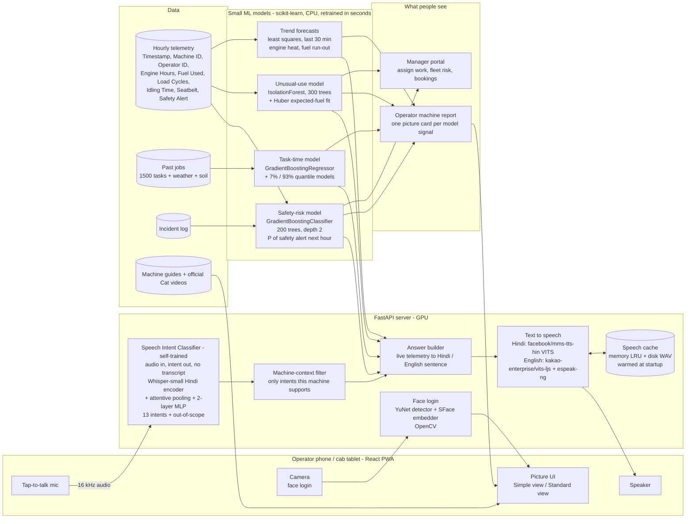
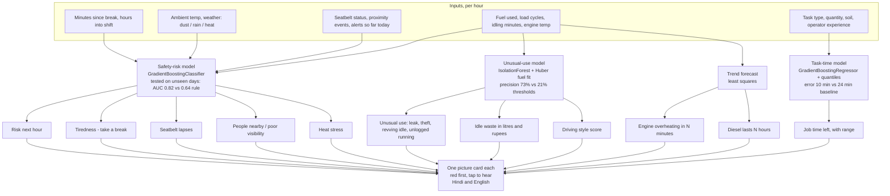

# CAT Saathi - architecture

Paste either block into https://mermaid.live to render it, or view this file on GitHub.
Rendered: [system](architecture-system.png), [models](architecture-models.png).

## 1. System

## 2. The models and the signals they produce

