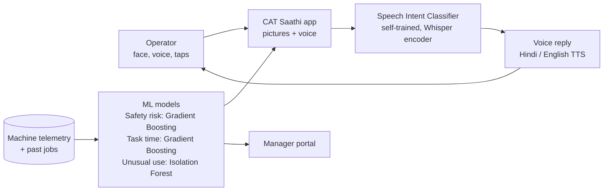
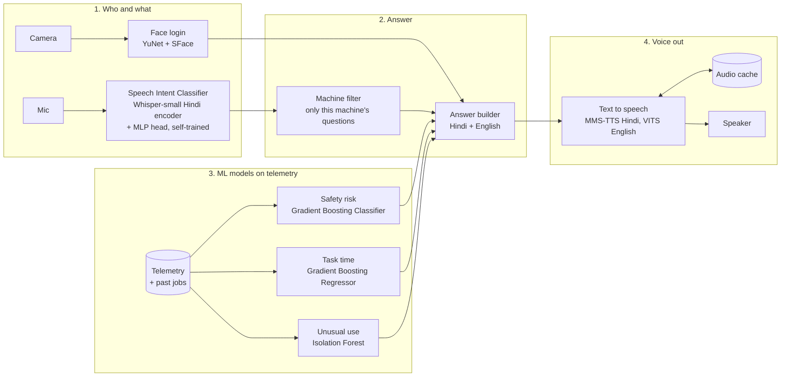
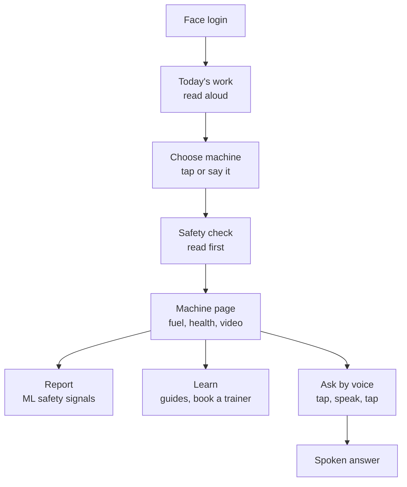

# CAT Saathi - diagrams

Paste either block into https://mermaid.live to render it, or view this file on GitHub.
Rendered: [architecture](architecture-system.png), [architecture with models](architecture-detailed.png), [user flow](architecture-flow.png).

## 1. Architecture

## 2. Architecture, with the model at each step

## 3. User flow

